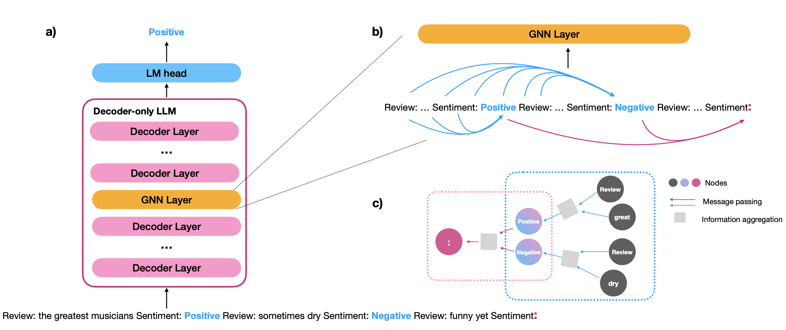

# GNNavi: Navigating the Information Flow in Large Language Models by Graph Neural Network
This repository contains the code for the paper *GNNavi: Navigating the Information Flow in Large Language Models by Graph Neural Network*.



## Environments and Dependencies
- python==3.9.16
- pytorch==2.0.1
- pytorch-lightning==2.0.2
- torch-geometric==2.3.0
- transformers==4.37.2 
- peft==0.5.0
- adapters==0.1.1

Install all the required dependencies:
```
pip install -r requirements.txt
```

## Training
Training with the default setting:
```
./train.sh [model] [method]
```
Please replace [model] with **gpt2** or **llama**.

Please replace [method] with following methods:

- gnn : GNNavi
- lora : LoRA 
- prefix : Prefix tuning
- adapter : Adapter
- fpft: Full Parameter Fine-tuning


## GNNAVI
In the code, the default setting for GNNavi is GNNavi-GCN. You can use other GNN architechtures by changing the GNN layer in `./src/models/gpt2_gnn.py` or `./src/models/llama_gnn.py`. 
